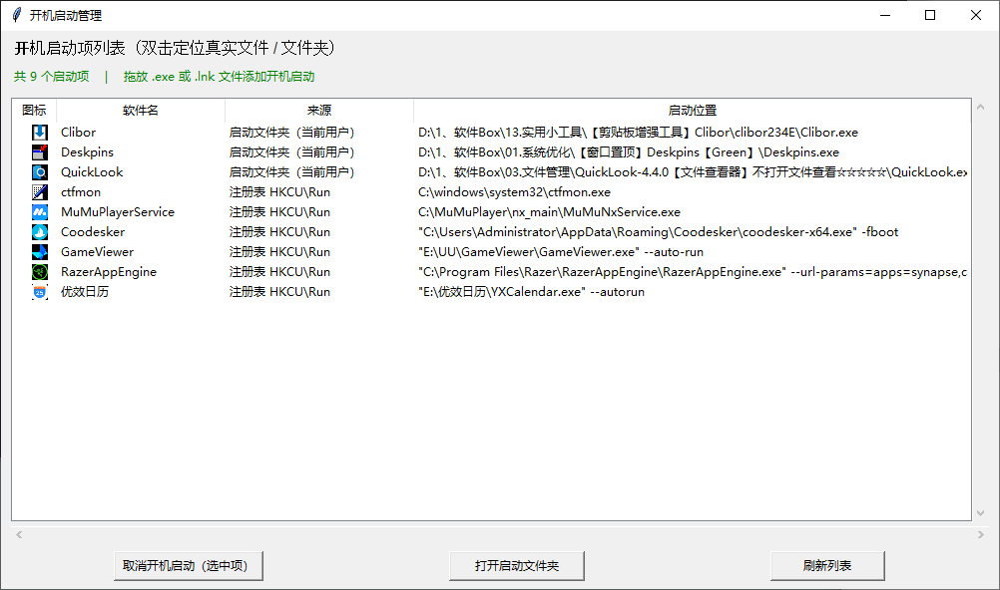

# Windows 开机启动管理器



Windows 开机启动管理器是一个用于查看、定位、管理和添加 Windows 开机启动项的工具。程序通过图形界面展示当前系统中常见的开机启动来源，支持扫描启动文件夹、注册表启动项以及 Windows 自动启动服务，并提供图标显示、双击定位、删除当前用户启动项、拖放添加启动项等功能。

程序仅适用于 Windows 系统，使用 Python 编写，依赖 `pywin32`、`pillow`、`tkinterdnd2` 等库。

## 主要功能

- 扫描当前用户启动文件夹中的启动项
- 扫描所有用户启动文件夹中的启动项
- 扫描 `HKCU` 和 `HKLM` 下的 `Run` 启动项
- 扫描 `HKCU` 和 `HKLM` 下的 `RunOnce` 启动项
- 扫描 Windows 自动启动服务
- 解析带空格、带引号、带参数的启动命令
- 提取并显示启动项图标
- 双击启动项定位真实可执行文件或所在文件夹
- 删除当前用户可管理的启动项
- 对需要管理员权限或系统级启动项进行只读展示
- 支持拖放 `.exe` 或 `.lnk` 文件到窗口，添加到当前用户启动文件夹
- 提供“打开启动文件夹”按钮，快速打开当前用户 Startup 目录
- 提供错误日志记录，便于排查异常

## 扫描范围

程序会扫描以下启动来源：

| 来源 | 路径或注册表位置 | 是否可直接删除 |
| --- | --- | --- |
| 当前用户启动文件夹 | `%APPDATA%\Microsoft\Windows\Start Menu\Programs\Startup` | 可删除 |
| 所有用户启动文件夹 | `%PROGRAMDATA%\Microsoft\Windows\Start Menu\Programs\Startup` | 只读 |
| HKCU Run | `HKEY_CURRENT_USER\Software\Microsoft\Windows\CurrentVersion\Run` | 可删除 |
| HKLM Run | `HKEY_LOCAL_MACHINE\SOFTWARE\Microsoft\Windows\CurrentVersion\Run` | 只读 |
| HKCU RunOnce | `HKEY_CURRENT_USER\Software\Microsoft\Windows\CurrentVersion\RunOnce` | 可删除 |
| HKLM RunOnce | `HKEY_LOCAL_MACHINE\SOFTWARE\Microsoft\Windows\CurrentVersion\RunOnce` | 只读 |
| 自动启动服务 | Windows 服务中启动类型为“自动”的服务 | 只读 |

程序启动时会确保当前用户启动文件夹存在。

## 界面说明

主界面标题为“开机启动管理”，默认窗口大小约为 `1000x560`，最小尺寸约为 `800x420`，支持调整窗口大小。

界面主要包含以下区域：

### 顶部提示区

显示程序标题和操作提示：

- 标题：开机启动项列表，双击可定位真实文件或文件夹
- 状态栏：显示启动项数量、拖放添加提示、扫描结果等

### 启动项列表

使用树形列表展示启动项，列包括：

- 图标：显示启动项关联图标
- 软件名：启动项显示名称
- 来源：启动项来源，例如启动文件夹、注册表、系统服务
- 启动位置：启动命令、目标路径或服务路径

列表支持垂直滚动和水平滚动。

### 底部按钮区

提供三个操作按钮：

- 取消开机启动（选中项）
- 打开启动文件夹
- 刷新列表

## 操作说明

### 刷新列表

点击“刷新列表”按钮后，程序会重新扫描所有支持的开机启动来源，并更新列表内容。

如果没有找到任何启动项，状态栏会显示相应提示。

### 双击定位

双击列表中的某一项时，程序会根据启动项类型执行不同操作：

- 如果该项是系统服务：
  - 若能解析到真实可执行文件，则在资源管理器中定位该文件
  - 若无法定位，则提示服务名，并询问是否打开 `services.msc`

- 如果该项是注册表启动项：
  - 尝试解析启动命令中的可执行文件
  - 如果文件存在，则在资源管理器中定位
  - 如果文件不存在，会尝试在 `PATH` 环境变量中查找
  - 若仍无法定位，则提示启动命令，并询问是否打开注册表编辑器

- 如果该项来自启动文件夹：
  - 优先在资源管理器中定位 Startup 文件夹中的快捷方式
  - 如果快捷方式不存在，则尝试定位目标路径
  - 如果目标路径不存在，则尝试定位原始路径
  - 若仍无法定位，则提示无法定位文件路径

### 取消开机启动

选中列表中的某一项后，点击“取消开机启动（选中项）”按钮，程序会弹出确认提示。

确认后：

- 当前用户启动文件夹中的 `.lnk` 快捷方式会被删除
- `HKCU Run` 和 `HKCU RunOnce` 中的注册表值会被删除
- 对 `HKLM`、所有用户启动文件夹、系统服务等只读项，程序会提示需要管理员权限或不能直接删除，请手动处理

删除成功后会刷新列表。

### 打开启动文件夹

点击“打开启动文件夹”按钮，会直接打开当前用户的 Startup 启动目录：

`%APPDATA%\Microsoft\Windows\Start Menu\Programs\Startup`

### 拖放添加启动项

可以将 `.exe` 或 `.lnk` 文件拖放到程序窗口中，程序会将其添加到当前用户启动文件夹。

添加规则：

- 仅接受 `.exe` 和 `.lnk` 文件
- 会在当前用户 Startup 文件夹中创建快捷方式
- 如果存在同名快捷方式，会自动追加 `_1`、`_2` 等编号
- 如果拖入的是 `.exe`，快捷方式的工作目录会设置为该 EXE 所在目录
- 支持带空格路径
- 支持环境变量展开
- 添加成功后会刷新列表并提示成功
- 如果未添加任何项，状态栏会提示请拖入 `.exe` 或 `.lnk`

## 启动命令解析

程序对启动命令进行专门解析，以尽可能准确地提取可执行文件路径。

支持的启动命令形式包括：

- 带引号路径：`"C:\Program Files\App\App.exe" /startup`
- 不带引号但包含空格的路径：`C:\Program Files\App\App.exe /startup`
- 带环境变量的路径：`%ProgramFiles%\App\App.exe /startup`
- 仅 EXE 名称：`App.exe /startup`
- 带多个参数的启动命令

解析逻辑会优先识别命令中的 `.exe` 路径，避免简单使用空格分割导致路径被截断。解析后会返回可执行文件路径和参数部分。

## 快捷方式解析

对于 `.lnk` 快捷方式，程序使用 `WScript.Shell` 进行解析，获取以下信息：

- 目标程序路径
- 启动参数
- 工作目录
- 图标位置

如果快捷方式指定了图标，则优先使用该图标；否则尝试使用目标程序图标；最后尝试使用快捷方式自身图标。

## 图标提取

程序支持从以下文件提取图标：

- `.exe`
- `.dll`
- `.ico`
- `.lnk`

图标提取使用 Windows API 完成，包括 `ExtractIcon`、`DrawIconEx` 等。提取后的图标会转换为 PIL 图像，并在界面中显示。

图标默认大小为 `16x16`，并带有缓存机制，避免重复提取。

## 权限与只读规则

程序对启动项进行权限区分：

- 当前用户启动文件夹：可直接删除
- 当前用户注册表 `Run`、`RunOnce`：可直接删除
- 所有用户启动文件夹：只读
- `HKLM` 注册表启动项：只读
- Windows 自动启动服务：只读

对于只读项，程序仍会显示，但不会直接删除。用户需要通过管理员权限或其他系统工具手动处理。

## 服务扫描

程序会扫描 Windows 服务中启动类型为“自动启动”的服务。

服务信息包括：

- 服务显示名称
- 来源标记为“系统服务（自动启动）”
- 服务二进制路径
- 服务名
- 可执行文件路径
- 启动参数

服务项默认不可直接删除。双击服务项时，如果能够定位到可执行文件，则打开资源管理器定位；否则询问是否打开服务管理器。

## 注册表扫描

程序会读取以下注册表位置：

- `HKCU\Software\Microsoft\Windows\CurrentVersion\Run`
- `HKLM\SOFTWARE\Microsoft\Windows\CurrentVersion\Run`
- `HKCU\Software\Microsoft\Windows\CurrentVersion\RunOnce`
- `HKLM\SOFTWARE\Microsoft\Windows\CurrentVersion\RunOnce`

每个注册表值会显示为启动项，并记录：

- 名称
- 来源
- 启动命令
- 注册表路径
- 删除动作
- 是否为注册表项
- 解析出的 EXE 路径
- 参数

`HKCU` 项可直接删除，`HKLM` 项默认只读。

## 错误日志

程序会在自身所在目录下生成 `error.log` 文件。

以下情况会记录日志：

- 快捷方式解析失败
- 图标提取失败
- 注册表值删除失败
- 服务扫描失败
- 添加启动项失败
- 双击定位失败
- 删除启动项失败
- 程序启动失败

如果程序启动失败，会尝试弹出错误提示，并提示查看 `error.log`。

## 依赖安装

运行前需要安装以下依赖：

```bash
pip install pywin32 pillow tkinterdnd2
